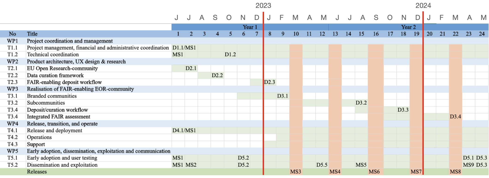

# HORIZON-ZEN

*FAIR-enabling deposit services in Zenodo for EU research programme beneficaries*

- Call: HORIZON-INFRA-2023-EOSC-REP-ART195-IBA
- Project ID: 101122956

### Collaboation tools

- [Projects](https://github.com/zenodo/horizon-zen/projects?query=is%3Aopen) ([work plan](https://github.com/orgs/zenodo/projects/33), [user stories](https://github.com/orgs/zenodo/projects/38), [decision log](https://github.com/orgs/zenodo/projects/34), [risks](https://github.com/orgs/zenodo/projects/36), [stakeholders](https://github.com/orgs/zenodo/projects/37), [dissemination activities](https://github.com/orgs/zenodo/projects/39), [KPIs](https://github.com/orgs/zenodo/projects/40)) 
- [Meetings (Indico)](https://indico.cern.ch/category/17009/) (restricted access)
- [Repository (Zenodo-community)](https://zenodo.org/communities/horizon-zen/)
- [Google Docs](http://drive.google.com/drive/u/0/folders/1iKUwst8wYxP2HLkpGi48flQkLrMjZiTN)
- [project-horizon-zen@cern.ch](mailto:project-horizon-zen@cern.ch)

Need access? Contact [lars.holm.nielsen@cern.ch](mailto:lars.holm.nielsen@cern.ch)

### Programme expectations

- Help EU programme beneficiaries to comply with FAIR requirements.
- Enable beneficiaries to see benefits of FAIR data.
- Maximize reuse of EU-funded research outputs.

### Expected results

- A new Zenodo-community for the EC's programme beneficaries with a) support for subcommunities for EU-projects and b) identification of programme beneficaries c) visual branding of the EC.
- A workflow to identify a Zenodo user as an EC programme beneficiary.
- A data curation framework that incentivizes programme beneficaries to curate the Zenodo-community supported by automated checks to harmonize curation across beneficaries.
- Integration of FAIR assessment using third-party tools into the deposit form of Zenodo including support for discipline specific metadata/vocabularies.

### Work plan

